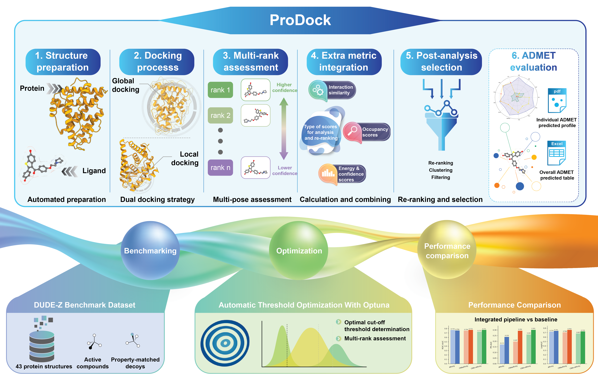
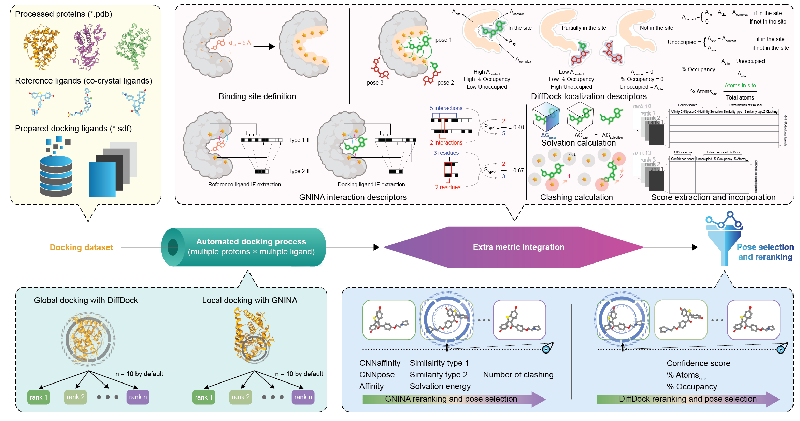

**ProDock — Semi-automated Rank-Resolved Multi-Engine Docking Pipeline for Virtual Screening**

**ProDock** is a semi-automated Python package for protein preparation, ligand preparation, docking execution, and rank-resolved post-docking analysis.

The workflow combines global docking with **DiffDock** and local docking with **GNINA**, preserving multiple poses per ligand instead of reducing each docking run to a single top-ranked conformer. Each pose rank is evaluated independently using engine-specific scores and additional descriptors.

For **GNINA**, these descriptors include:

- empirical affinity;
- `CNNpose`;
- `CNNaffinity`;
- Reference-based protein–ligand interaction-fingerprint similarity: `Similarity-type1` and `Similarity-type2`
- Steric clash counts; and
- Optional electrostatic solvation energy.

For **DiffDock**, the evaluated descriptors include:
- Confidence score;
- Unoccupied region, representing the absence of an interaction surface between the protein and ligand; and
- Percentage of ligand atoms remaining within the binding site and percentage of Occupancy.

**ProDock** builds on established cheminformatics, visualization, and molecular-simulation libraries, including [RDKit](https://www.rdkit.org/), [PyMOL](https://www.pymol.org/), [Open Babel](https://openbabel.org/), [OpenMM](https://openmm.org/), [MDAnalysis](https://www.mdanalysis.org/), [ProLIF](https://prolif.readthedocs.io/), [Biopython](https://biopython.org/), and [APBS](https://www.poissonboltzmann.org/).

The package writes structured intermediate files and target-specific output directories so that protein preparation, ligand preparation, docking, re-ranking, and downstream inspection can be repeated from explicit inputs.

## Installation

### Requirements

ProDock requires:

- Linux
- Git
- Conda
- Python 3.11
- NVIDIA GPU recommended
- A compatible CUDA installation for GPU-enabled DiffDock and GNINA execution

### 1. Clone ProDock

Clone the `Son-dev-updated` branch together with its registered submodules:

```bash
git clone \
  --branch Son-dev-updated \
  --recurse-submodules \
  https://github.com/Medicine-Artificial-Intelligence/ProDock.git

cd ProDock
```

The required directories should be located directly under the ProDock root:

```text
ProDock/
├── DiffDock/
├── gnina/
├── environment.yml
└── README.md
```

### 2. Create the ProDock Environment

ProDock requires Python 3.11.

Create the Conda environment from `environment.yml`:

```bash
conda env create --file environment.yml
```

Activate the environment:

```bash
conda activate ProDock
```

### 3. Install DiffDock

Follow DiffDock installation [DiffDock]([https://www.rdkit.org/](https://github.com/gcorso/DiffDock)
Make sure to clone DiffDock directly under ProDock root.

```bash
git
  https://github.com/gcorso/DiffDock.git \
  DiffDock
```


### 4. Install ESM

The ESM Python package must be located directly inside the DiffDock directory:

```text
ProDock/DiffDock/esm/
```
The final directory structure must be:
```text
DiffDock/
└── esm/
    ├── esmfold/
    ├── inverse_folding/
    ├── model/
    ├── __init__.py
    ├── data.py
    ├── modules.py
    ├── pretrained.py
    └── ...
```

Clone the ESM repository into a temporary directory:

```bash
git clone \
  https://github.com/facebookresearch/esm.git \
  esm_source=
```

Copy the inner ESM Python package directly into `DiffDock/esm`:

```bash
cp -r esm_source/esm DiffDock/esm
```

### 5. Install GNINA

The GNINA directory must be located directly under the ProDock root:

```text
ProDock/gnina/
```

The GNINA executable must be located at:

```text
ProDock/gnina/gnina
```

Enter the GNINA directory:

```bash
mkdir -p gnina
cd gnina
```

Download a compatible GNINA Linux binary from the official release page:

https://github.com/gnina/gnina/releases

Using `wget`:

```bash
wget -O gnina "<GNINA_BINARY_URL>"
```

Alternatively, using `curl`:

```bash
curl -L "<GNINA_BINARY_URL>" -o gnina
```

Replace `<GNINA_BINARY_URL>` with the URL of the selected GNINA release asset.

Make the binary executable:

```bash
chmod +x gnina
```

Return to the ProDock root directory:

```bash
cd ..
```

Test the GNINA installation:

```bash
./gnina/gnina --version
```

Display the available GNINA options:

```bash
./gnina/gnina --help
```

### 6. Complete Installation

The final directory structure should resemble:

```text
ProDock/
├── Analysis_script/
├── Optimization_script/
├── DiffDock/
│   ├── esm/
│   └── ...
├── gnina/
│   ├── gnina
│   └── ...
├── environment.yml
├── LICENSE
└── README.md
```

**Overall workflow**

Protein Preparation

Ligand Preparation


## Usage: Pose Re-ranking Optimization and Analysis

After docking, ProDock keeps every pose rank and evaluates it with engine-specific
scores and descriptors. The scripts below merge the per-pose GNINA and DiffDock
results, use **Optuna** to tune per-descriptor thresholds that maximize a chosen
performance metric (ROC-AUC, PR-AUC, or logAUC), and then extract and visualize the
optimized results.

### 1. Threshold Optimization (`Optimization_script/`)

Expected input layout, one CSV of merged per-pose scores per target for each engine:

```text
all/
├── gnina/{target}/Confidence_score/{target}_final.csv
└── diffdock/{target}/Confidence_score/{target}_final.csv
```

Optimize a single target:

```bash
cd Optimization_script
python optuna_combine_all_structure.py --protein ABL1 --base-dir all --metric roc-auc
```

Common options:

- `--scoring-metric {affinity,cnnaffinity,cnn-combined}` — score used for the final ranking.
- `--metric {roc-auc,pr-auc,logauc}` — objective that Optuna maximizes.
- `--n-trials`, `--n-jobs`, `--top-k` — Optuna trial budget, parallel trials, poses kept per ligand.
- `--split {train,test}`, `--data-dir split_merged`, `--eval-on-test` — train/test handling; with
  `--data-dir` the inputs are read as `{data_dir}/{protein}_{split}.csv`.

Optimize every target found under `--base-dir` (batch driver):

```bash
cd Optimization_script
python run_all_proteins_optimization.py --base-dir all --metric roc-auc --parallel 4
```

Run this from inside `Optimization_script/`; it invokes `optuna_combine_all_structure.py`
by relative path. For each target it writes
`results_all_structure/{target}/{target}_all_structure_results.json` plus a batch-summary
JSON. Repeating the run across the nine scoring × metric configurations reproduces the
manuscript results.

### 2. Results Extraction and Figures (`Analysis_script/`)

Collect the optimized thresholds from the nine configuration folders
(`aff|cnn|combined` × `log|pr|roc`) into one CSV per configuration:

```bash
cd Analysis_script
python extract_optimized_thresholds.py --root .. --output-dir threshold_csv
```

Each configuration folder is expected to hold `{TARGET}/{TARGET}_all_structure_results.json`;
the script writes `threshold_csv/{config}_thresholds.csv`.

Generate the publication figures from the nine per-configuration summary files
(`{scoring}_{metric}.json`, e.g. `aff_roc.json`, `cnn_pr.json`, `combined_log.json`) placed
alongside the script; figures are written to `figures/`:

```bash
cd Analysis_script
python visualize_results.py
```

## License
This project is licensed under MIT License - see the [License](LICENSE) file for details.

## Authors & Contributors
- [Lai Hoang Son Le](https://github.com/lelaihoangson)
- [Thanh-An Pham](https://github.com/Thanh-An-Pham)
- [Tieu-Long Phan](https://tieulongphan.github.io/)

## Acknowledgments
This work has received support from the Korea International Cooperation Agency (KOICA) under the project entitled ``Education and Research Capacity Building Project at University of Medicine and Pharmacy at Ho Chi Minh City,'' conducted from 2024 to 2025 (Project No. 2021-00020-3). TLP and PFS have received funding from the European Union's Horizon Europe Doctoral Network programme under the Marie Sk{\l}odowska-Curie grant agreement No.~101072930 (TACsy - Training Alliance for Computational systems chemistry).
