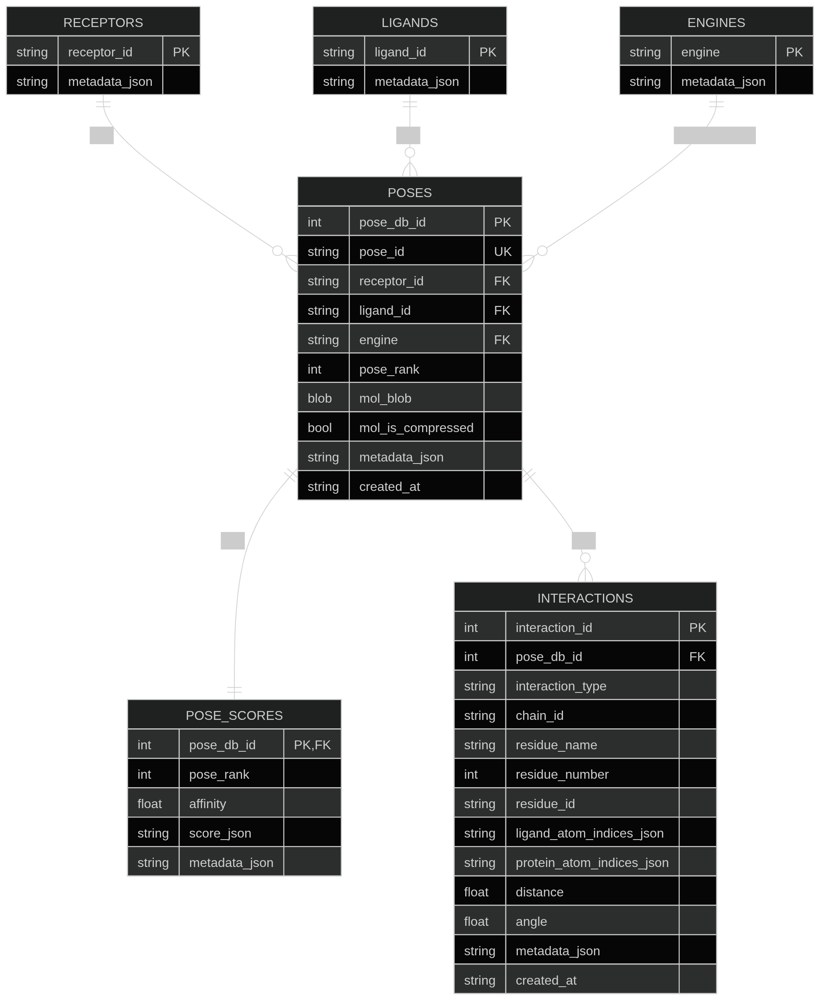
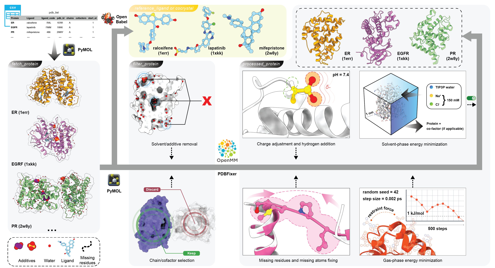
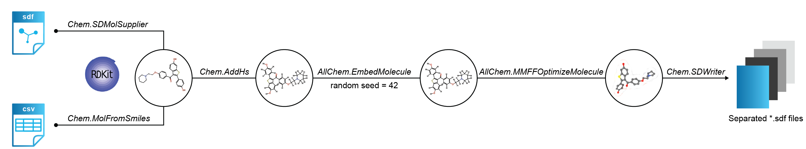

# ProDock
Automatic pipeline for molecular modeling

[](https://pypi.org/project/prodock/)
[](https://anaconda.org/tieulongphan/prodock)
[](https://hub.docker.com/r/tieulongphan/prodock)
[](https://hub.docker.com/r/tieulongphan/prodock)
[](https://github.com/Medicine-Artificial-Intelligence/prodock/blob/main/LICENSE)
[](https://github.com/Medicine-Artificial-Intelligence/prodock/releases)
[](https://github.com/Medicine-Artificial-Intelligence/prodock/commits)
[](https://github.com/Medicine-Artificial-Intelligence/prodock/actions/workflows/test-and-lint.yml)
[](https://github.com/Medicine-Artificial-Intelligence/prodock/pulls?q=is%3Apr+label%3Adependencies)
[](https://github.com/Medicine-Artificial-Intelligence/prodock/stargazers)


## Overview

**ProDock** is a toolkit for building automated molecular docking workflows. It is designed for campaigns involving multiple receptors, multiple ligands, and multiple docking engines, with support for downstream pose extraction, interaction profiling, visualization, and SQLite-backed result management. Please visit [Documentation](https://prodock.readthedocs.io/en/latest/) for more details.

### Documentation map

| Goal | Start here |
| --- | --- |
| Install and verify ProDock | [Getting started](https://prodock.readthedocs.io/en/latest/getting_started.html) |
| Run a JSON-driven campaign | [Automation tutorial](https://prodock.readthedocs.io/en/latest/tutorial/automation.html) |
| Combine and rerank GNINA/DiffDock results | [Reranking guide](https://prodock.readthedocs.io/en/latest/reranking.html) |
| Record a reproducible run | [Reproducibility guide](https://prodock.readthedocs.io/en/latest/reproducibility.html) |
| Browse commands and Python APIs | [CLI reference](https://prodock.readthedocs.io/en/latest/api/cli.html) and [API index](https://prodock.readthedocs.io/en/latest/api.html) |

The project aims to provide one consistent workflow for:

- receptor and ligand preparation
- batch docking across one or more engines
- pose extraction into standardized tables
- interaction analysis from docked complexes
- database storage for poses, scores, and interactions
- reproducible downstream analysis

This makes ProDock useful both for small docking experiments and for larger benchmark-style or screening-style studies.

In addition to classical scoring-function engines (e.g. AutoDock Vina), ProDock provides a **semi-automated, rank-resolved, multi-engine pipeline** that combines global docking with **DiffDock** and local docking with **GNINA** for virtual screening. See [DiffDock + GNINA GPU pipeline](#diffdock--gnina-gpu-pipeline) below.

## Main capabilities

### Docking workflow
ProDock supports automated docking workflows across multiple receptor-ligand combinations and can be organized as single-target, multi-ligand, or multi-receptor campaigns.

Typical use cases include:

- one receptor with many ligands
- many receptors with one ligand set
- many receptors with many ligands
- comparison of multiple docking engines on the same campaign

### Post-processing
After docking, ProDock can parse docking outputs and convert them into structured pose tables with canonical columns such as:

- `receptor_id`
- `ligand_id`
- `engine`
- `pose_rank`
- `affinity`
- `mol`
- `pose_id`

These standardized tables make it easier to compare poses across engines and campaigns.

### Interaction analysis
ProDock supports protein-ligand interaction extraction and summarization, enabling residue-level interaction profiles for each pose. This is intended for downstream comparison, ranking, and interpretation of docking results.

### Rank-resolved multi-engine scoring
The DiffDock + GNINA pipeline preserves multiple poses per ligand instead of reducing each docking run to a single top-ranked conformer. Each pose rank is evaluated independently using engine-specific scores and additional descriptors.

For **GNINA**, these descriptors include:

- empirical affinity;
- `CNNpose`;
- `CNNaffinity`;
- Reference-based protein–ligand interaction-fingerprint similarity: `Similarity-type1` and `Similarity-type2`;
- Steric clash counts; and
- Optional electrostatic solvation energy.

For **DiffDock**, the evaluated descriptors include:

- Confidence score;
- Unoccupied region, representing the absence of an interaction surface between the protein and ligand; and
- Percentage of ligand atoms remaining within the binding site and percentage of Occupancy.

### Database-backed storage
ProDock includes SQLite-based storage to keep docking poses and interaction records in a structured and queryable form. This is especially useful when handling many receptors, ligands, docking engines, and poses.

## Database architecture

ProDock stores docking outputs and associated interaction information in a relational SQLite database. This supports scalable querying, reproducible analysis, and easy export into pandas dataframes.

Database architecture figure:



This architecture is intended to support:

- pose-centric storage
- stable pose identifiers
- interaction lookup by pose, receptor, ligand, or engine
- multi-receptor and multi-engine benchmarking workflows
- clean integration with pandas- and RDKit-based analysis


## Installation

ProDock requires Python 3.11 or later. For a source installation:

```bash
git clone --recurse-submodules \
  https://github.com/Medicine-Artificial-Intelligence/ProDock.git
cd ProDock

conda create --name prodock-env python=3.11
conda activate prodock-env
python -m pip install -e .
```

Choose an additional profile only when needed:

| Goal | Command |
| --- | --- |
| GNINA + DiffDock reranking | `python -m pip install -e ".[reranking]"` |
| Reranking in an existing install | `python -m pip install -r requirements-reranking.txt` |
| Tests, linting, and reranking | `python -m pip install -r requirements-dev.txt` |
| Recreate the source-development Conda environment | `conda env create -f prodock-env.yml` |

Verify the package and inspect the command-line interface:

```bash
python -c "import prodock; print(prodock.__version__)"
prodock --help
```

Docking engines are external executables. Install the engines named in your
campaign and ensure commands such as `vina`, `smina`, `qvina`, or `qvina-w`
are available on `PATH`.

## DiffDock + GNINA GPU pipeline

The rank-resolved multi-engine pipeline builds on established cheminformatics, visualization, and molecular-simulation libraries, including [RDKit](https://www.rdkit.org/), [PyMOL](https://www.pymol.org/), [Open Babel](https://openbabel.org/), [OpenMM](https://openmm.org/), [MDAnalysis](https://www.mdanalysis.org/), [ProLIF](https://prolif.readthedocs.io/), [Biopython](https://biopython.org/), and [APBS](https://www.poissonboltzmann.org/). It writes structured intermediate files and target-specific output directories so that protein preparation, ligand preparation, docking, re-ranking, and downstream inspection can be repeated from explicit inputs.

### Requirements

The GPU pipeline requires:

- Linux
- Git
- Conda
- Python 3.11
- NVIDIA GPU recommended
- A compatible CUDA installation for GPU-enabled DiffDock and GNINA execution

### 1. Clone ProDock with submodules

Clone the repository together with its registered submodules:

```bash
git clone \
  --recurse-submodules \
  https://github.com/Medicine-Artificial-Intelligence/ProDock.git

cd ProDock
```

The submodule directories should be located under `Project/`:

```text
ProDock/
├── Project/
│   ├── DiffDock/
│   └── gnina/
├── environment.yml
└── README.md
```

### 2. Create the ProDock environment

Create the Conda environment from `environment.yml`:

```bash
conda env create --file environment.yml
```

Activate the environment:

```bash
conda activate ProDock
```

### 3. Install DiffDock

Follow the [DiffDock](https://github.com/gcorso/DiffDock) installation instructions. Make sure to clone DiffDock into `Project/`.

```bash
git clone \
  https://github.com/gcorso/DiffDock.git \
  Project/DiffDock
```

### 4. Install ESM

The ESM Python package must be located directly inside the DiffDock directory:

```text
ProDock/Project/DiffDock/esm/
```

The final directory structure must be:

```text
Project/DiffDock/
└── esm/
    ├── esmfold/
    ├── inverse_folding/
    ├── model/
    ├── __init__.py
    ├── data.py
    ├── modules.py
    ├── pretrained.py
    └── ...
```

Clone the ESM repository into a temporary directory:

```bash
git clone \
  https://github.com/facebookresearch/esm.git \
  esm_source
```

Copy the inner ESM Python package directly into `Project/DiffDock/esm`:

```bash
cp -r esm_source/esm Project/DiffDock/esm
```

### 5. Install GNINA

The GNINA directory must be located under `Project/`:

```text
ProDock/Project/gnina/
```

The GNINA executable must be located at:

```text
ProDock/Project/gnina/gnina
```

Enter the GNINA directory:

```bash
mkdir -p Project/gnina
cd Project/gnina
```

Download a compatible GNINA Linux binary from the official [release page](https://github.com/gnina/gnina/releases).

Using `wget`:

```bash
wget -O gnina "<GNINA_BINARY_URL>"
```

Alternatively, using `curl`:

```bash
curl -L "<GNINA_BINARY_URL>" -o gnina
```

Replace `<GNINA_BINARY_URL>` with the URL of the selected GNINA release asset.

Make the binary executable:

```bash
chmod +x gnina
```

Return to the ProDock root directory:

```bash
cd ../..
```

Test the GNINA installation:

```bash
./Project/gnina/gnina --version
```

Display the available GNINA options:

```bash
./Project/gnina/gnina --help
```

### 6. Complete installation

The final directory structure should resemble:

```text
ProDock/
├── Project/
│   ├── Analysis_script/
│   ├── Docking_script/
│   ├── Optimization_script/
│   ├── Preparation_script/
│   ├── DiffDock/
│   │   ├── esm/
│   │   └── ...
│   └── gnina/
│       ├── gnina
│       └── ...
├── Data/
│   └── fig/
├── environment.yml
├── LICENSE
└── README.md
```

**Overall workflow**


Protein Preparation


Ligand Preparation



## Reproducing the Case Study

To reproduce the case study, first clone and install ProDock as described above. Then run the command-line workflow using the provided configuration files:
```bash
python -m prodock \
  --config Data/case/config.json \
  --receptor-json Data/case/receptor.json \
  --ligand-json Data/case/ligand.json
```
This command executes the case-study docking workflow using:

- `Data/case/config.json`: global workflow and docking settings
- `Data/case/receptor.json`: receptor definitions
- `Data/case/ligand.json`: ligand definitions

## Pose Re-ranking Optimization and Analysis

The scripts under `Project/Optimization_script/` merge per-pose GNINA and
DiffDock results and use Optuna to tune descriptor thresholds for ROC-AUC,
PR-AUC, or logAUC. Install their optional dependencies from the repository
root:

```bash
pip install -e ".[reranking]"
```

The repository already contains the 43 GNINA/DiffDock target pairs used by
these scripts:

```text
Project/benchmark/
├── result_gnina/{target}_final.csv
└── result_diffdock/{target}_final.csv
```

These are DUD-E-style files without an embedded activity column. Pass
`--dude-labels` to apply the explicit dataset convention that `ZINC*`
identifiers are decoys and all other identifiers are actives. The `MT1` pair
contains `NONE` as its only non-ZINC identifier and should be excluded from
aggregate results until a valid active record is recovered.

Optimize one target:

```bash
python Project/Optimization_script/optuna_combine_all_structure.py \
  --protein ABL1 \
  --base-dir Project/benchmark \
  --dude-labels \
  --metric roc-auc
```

Useful options include:

- `--scoring-metric {affinity,cnnaffinity,cnn-combined}`
- `--metric {roc-auc,pr-auc,logauc}`
- `--n-trials`, `--n-jobs`, and `--top-k`
- `--split {train,test}`, `--data-dir split_merged`, and `--eval-on-test`
- `--activity-column` for datasets that carry explicit binary labels

Run all targets discovered under `--base-dir`:

```bash
python Project/Optimization_script/run_all_proteins_optimization.py \
  --base-dir Project/benchmark \
  --dude-labels \
  --exclude-proteins MT1 \
  --metric roc-auc \
  --parallel 4
```

The original nested export layout remains supported:

```text
all/
├── gnina/{target}/Confidence_score/{target}_{split}_final.csv
└── diffdock/{target}/Confidence_score/{target}_{split}_final.csv
```

For the training split, the legacy unsplit filename `{target}_final.csv` is
also accepted.

Results default to `results_all_structure/{target}/` relative to the working
directory. Use `--output-dir` to choose another location. Optimization output,
Optuna studies, extracted threshold tables, and publication plots are
generated artifacts and are intentionally ignored by Git.

Extract thresholds from the nine scoring/metric configuration directories:

```bash
python Project/Analysis_script/extract_optimized_thresholds.py \
  --root /path/to/configuration-results \
  --output-dir threshold_csv
```

To generate the publication plots, place the nine summary JSON files
(`aff_roc.json`, `cnn_pr.json`, `combined_log.json`, and the other
scoring/metric combinations) beside `visualize_results.py`, then run:

```bash
python Project/Analysis_script/visualize_results.py
```

See [`REPRODUCIBILITY.md`](REPRODUCIBILITY.md) for the tracked-input manifest,
artifact policy, and end-to-end verification commands.

## Setting Up Your Development Environment

Create the development environment and start from the current `main` branch:

```bash
conda env create -f prodock-env.yml
conda activate prodock
git switch main
git pull --ff-only
```

## Working on New Features

1. **Create a branch.** Use a short name that describes the feature or fix.

   ```bash
   git switch -c feature/your-feature-name
   ```

2. **Develop and commit.** Keep commits focused on one logical change.

   ```bash
   git add <changed-files>
   git commit -m "Describe the change"
   ```

3. **Run the quality checks.**

   ```bash
   ./lint.sh
   python -m pytest -q Test
   git diff --check
   ```

## Integrating Changes

Update the feature branch against the latest `main`, resolve conflicts locally,
and repeat the checks:

```bash
git fetch origin
git rebase origin/main
python -m pytest -q Test
```

Push the feature branch and open a pull request targeting `main`:

```bash
git push --set-upstream origin feature/your-feature-name
```

## Important Notes

- Do not commit generated campaign outputs, caches, built documentation, or
  local environment paths.
- Keep reproduction inputs and scripts visible in the commit tree; see
  [`REPRODUCIBILITY.md`](REPRODUCIBILITY.md) for the artifact boundary.
- Use pull requests for changes to `main` and include the validation commands
  in the pull-request description.

## Publication

[**ProDock: From multi-target consensus docking into database-backed storage**](https://doi.org/10.48550/arXiv.2604.21828)


## License

This project is licensed under MIT License - see the [License](LICENSE) file for details.

## Authors & Contributors

- [Lai Hoang Son Le](https://github.com/lelaihoangson)
- [Thanh-An Pham](https://github.com/Thanh-An-Pham)
- [Tieu-Long Phan](https://tieulongphan.github.io/)

## Acknowledgments

This work has received support from the Korea International Cooperation Agency (KOICA) under the project entitled "Education and Research Capacity Building Project at University of Medicine and Pharmacy at Ho Chi Minh City", conducted from 2024 to 2025 (Project No. 2021-00020-3). TLP and PFS have received funding from the European Union's Horizon Europe Doctoral Network programme under the Marie Skłodowska-Curie grant agreement No. 101072930 (TACsy - Training Alliance for Computational systems chemistry).
