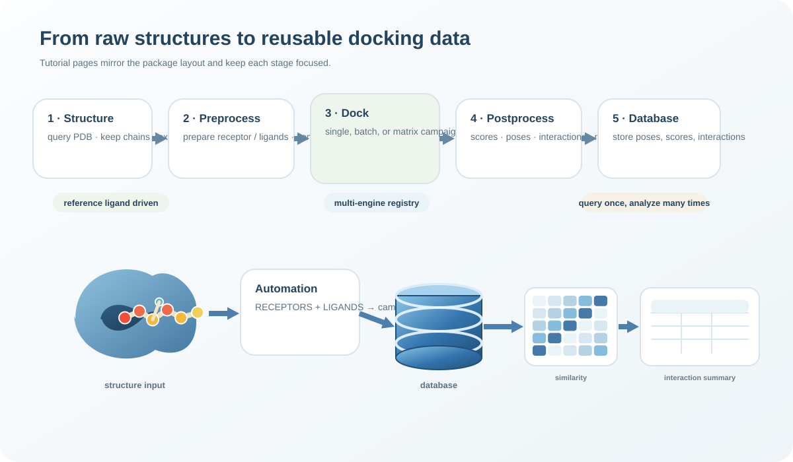
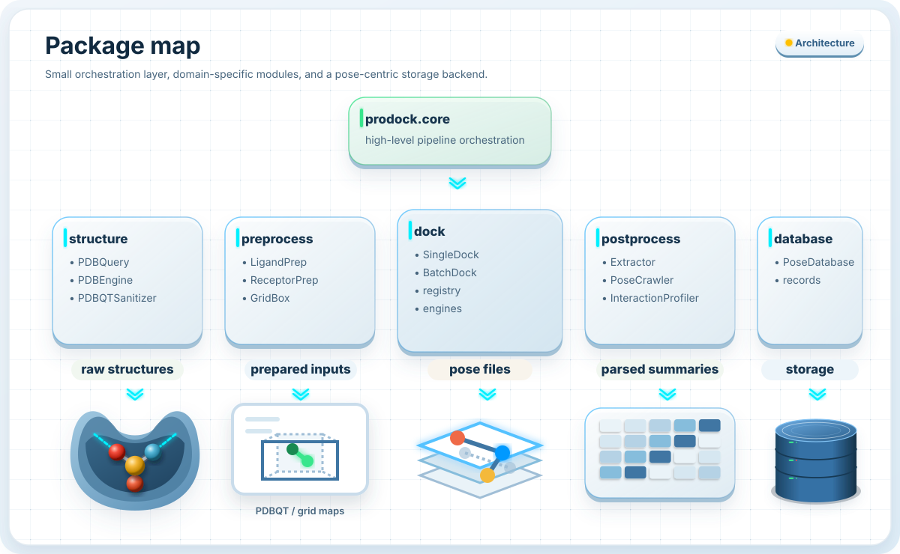
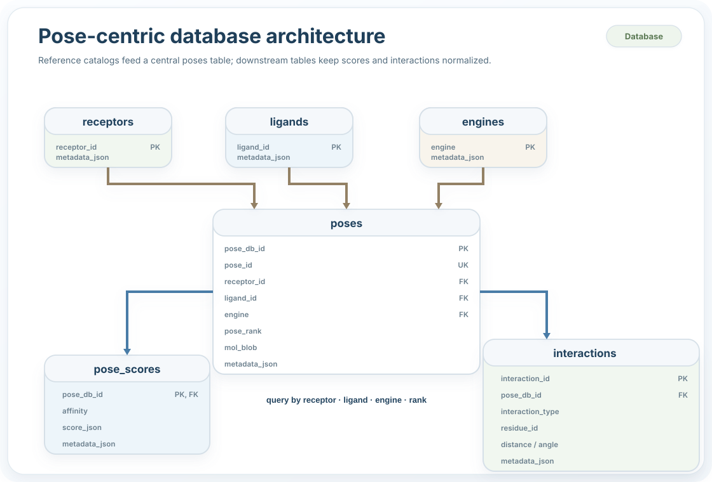

Architecture
============

.. raw:: html

   

     
System design

     <h2>Structured Architecture for High-Throughput Docking</h2>
     

       ProDock structures molecular docking as a scalable campaign, systematically managing <strong>many-to-many relationships across receptors, ligands, and engines</strong>. A pose-centric database ensures rigorous downstream analysis and computational reproducibility.
     

   

System Motivation
-----------------

.. raw:: html

   

     

       <h4>📂 File-System Robustness</h4>
       
Standard directory-based storage fails at scale; ProDock centralizes data to prevent fragmentation.

     

     

       <h4>🔗 Relational Integrity</h4>
       
Explicit linkages between receptors, ligands, search algorithms, and poses are strictly maintained.

     

     

       <h4>♻️ Retrospective Analysis</h4>
       
Persistent pose records enable efficient consensus scoring, interaction profiling, and statistical reporting.

     

   

Architectural Objectives
------------------------

.. raw:: html

   

     

       <h4>🧭 Deterministic Workflow</h4>
       
Structure → Preprocess → Dock → Postprocess → Database.

     

     

       <h4>⚙️ Automated Execution</h4>
       
Structured entity definitions guarantee exact reproducibility of computational campaigns.

     

     

       <h4>🔌 Engine Agnosticism</h4>
       
A unified framework abstracts underlying algorithms, permitting seamless backend integration.

     

     

       <h4>🗄️ Pose-Centric Storage</h4>
       
SQLite integration retains discrete outputs as highly queryable, structured records.

     

   

Workflow Architecture
---------------------

Package Dependency Map
----------------------

Relational Database Architecture
--------------------------------

.. raw:: html

   

     
Core Architectural Paradigm

     

       The database maps the comprehensive <strong>receptor–ligand–engine–pose</strong> phase space, elevating ProDock into a robust <strong>many-to-many querying framework</strong>.
     

   

.. raw:: html

   

     

       <h4>🧬 Receptors</h4>
       
Prepared target libraries.

     

     

       <h4>🧪 Ligands</h4>
       
High-throughput screening sets.

     

     

       <h4>⚙️ Engines</h4>
       
Diverse docking algorithms.

     

     

       <h4>📍 Poses</h4>
       
Ranked structural predictions.

     

   

Database Infrastructure
-----------------------

.. raw:: html

   

     <strong>Architectural Imperative:</strong> ProDock strictly decouples execution from analysis. The persistent database supports rigorous comparative queries without iterative re-computation.
   
