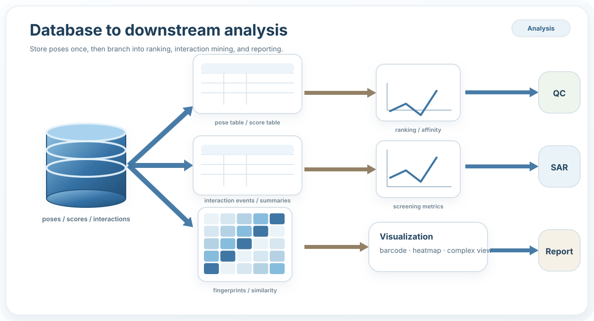

Overview
========

.. raw:: html

   

     

       
workflow-first molecular docking

       
Automate docking, then reuse the same results for analysis

       
Prepare structures, build docking inputs, run campaigns across engines, and keep poses, scores, and interactions queryable in one SQLite database.

       

         <a class="pd-btn pd-btn--primary" href="getting_started.html">Get started</a>
         <a class="pd-btn" href="tutorial.html">Tutorial</a>
         <a class="pd-btn" href="architecture.html">Architecture</a>
         <a class="pd-btn" href="api.html">API</a>
       

       

         
         
         
         
         
         
         
         
         
         
       

     

     

       
     

   

.. raw:: html

   

     <a class="pd-card" href="tutorial.html">
Tutorial
<h3>Follow the workflow</h3>
Structure, preprocess, dock, postprocess, database, and automation pages stay grouped under one tutorial hub.
</a>
     <a class="pd-card" href="architecture.html">
Architecture
<h3>Understand the design</h3>
See why ProDock uses a pose-centric database and how the package is split into reusable layers.
</a>
     <a class="pd-card" href="api.html">
API
<h3>Scan the package</h3>
Start with a short API page, then move to a larger automodule-based reference under the same API section.
</a>
   

Store once, analyze many times
------------------------------

.. raw:: html

   

     

       <h3>Package map</h3>
       
Core orchestration stays compact while structure, preprocess, docking, postprocess, and database modules remain reusable.

       

     

     

       <h3>Database overview</h3>
       
Catalog tables feed a central poses table, which branches into score and interaction storage.

       

     

   

.. toctree::
   :maxdepth: 2
   :hidden:

   getting_started
   tutorial
   architecture
   api
   reference
