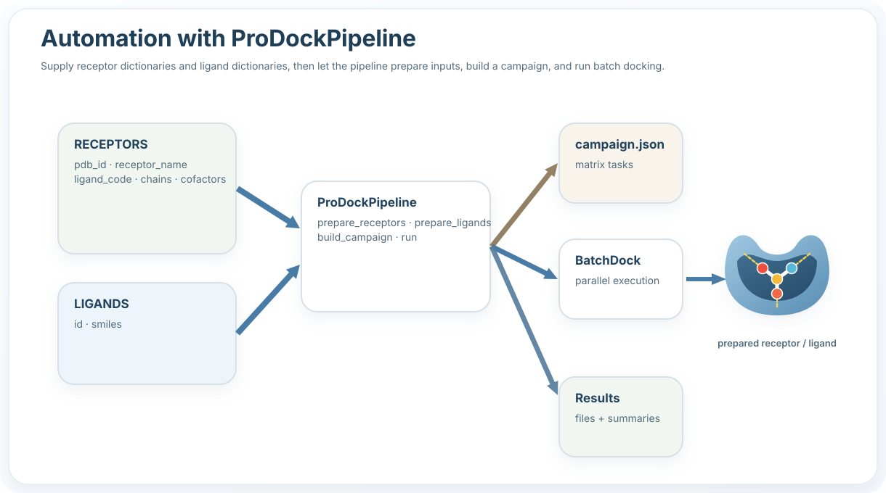

Automation
==========

.. raw:: html

   

     

       
Workflow automation

       <h2>Run end-to-end docking with one function or one command</h2>
       

         ProDock integrates receptor preparation, ligand preparation, campaign construction,
         multi-engine docking, pose crawling, interaction profiling, and SQLite export
         into one reproducible workflow.
       

     

     

       

         

           🧬
           

             <strong>Receptors</strong>
             
Prepare one or many protein structures from raw PDB specifications.

           

         

         

           ⚗️
           

             <strong>Ligands</strong>
             
Generate docking-ready ligand files from SMILES records.

           

         

         

           ⚙️
           

             <strong>Engines</strong>
             
Run one or more docking backends in the same workflow.

           

         

         

           🗄️
           

             <strong>Results</strong>
             
Store poses and interactions in a project-local SQLite database.

           

         

       

     

   

Overview
--------

.. raw:: html

   

     

       

         🐍
         <h3>Python API</h3>
       

       
Use <code>prodock(...)</code> for the fastest end-to-end workflow.

     

     

       

         💻
         <h3>Command line</h3>
       

       
Run the same workflow with <code>prodock --config config.json</code>.

     

     

       

         📁
         <h3>Project-local outputs</h3>
       

       
Campaigns, poses, interactions, and SQLite outputs stay inside one project directory.

     

   

Expected input format
---------------------

.. raw:: html

   

     

       

         🧬
         <h3>Receptors</h3>
       

       
Each receptor record defines a PDB structure, a reference ligand, selected chains, and optional cofactors.

     

     

       

         ⚗️
         <h3>Ligands</h3>
       

       
Each ligand record defines an <code>id</code> and a SMILES string for preparation.

     

   

.. code-block:: python

   RECEPTORS = [
       {
           "pdb_id": "1M17",
           "receptor_name": "EGFR_1M17",
           "ligand_code": "AQ4",
           "chains": ["A"],
           "cofactors": [],
       },
       {
           "pdb_id": "2ITY",
           "receptor_name": "EGFR_2ITY",
           "ligand_code": "IRE",
           "chains": ["A"],
           "cofactors": [],
       },
       {
           "pdb_id": "4WKQ",
           "receptor_name": "EGFR_4WKQ",
           "ligand_code": "IRE",
           "chains": ["A"],
           "cofactors": [],
       },
   ]

   LIGANDS = [
       {
           "id": "erlotinib",
           "smiles": "COCCOc1cc2c(ncnc2cc1OCCOC)Nc1cccc(c1)C#C",
       },
       {
           "id": "gefitinib",
           "smiles": "COc1cc2ncnc(c2cc1OCCCN1CCOCC1)Nc1ccc(c(c1)Cl)F",
       },
   ]

Python usage
------------

.. raw:: html

   

     
Recommended entry point

     
Use <code>from prodock import prodock</code> for the fastest complete workflow.

   

.. code-block:: python

   from prodock import prodock

   PROJECT = "EGFR_Automation"

   result = prodock(
       PROJECT,
       receptors=RECEPTORS,
       ligands=LIGANDS,
       engines=["qvina", "qvina-w"],
       extract_interaction=True,
       db_name="test.db",
   )

   print(result.campaign_json)
   print(result.db_path)
   print(result.pose_df.head())
   print(result.merged_df.head())

.. raw:: html

  

    

      

        📝
        <h3>Campaign</h3>
      

      
Serialized docking configuration in <code>campaign.json</code>.

    

    

      

        📍
        <h3>Poses</h3>
      

      
Ranked docked ligand poses collected from one or more engines.

    

    

      

        🔗
        <h3>Interactions</h3>
      

      
Optional protein-ligand contact tables, summaries, and fingerprints.

    

    

      

        🗄️
        <h3>Database</h3>
      

      
Optional SQLite export for downstream querying.

    

  

Common Python patterns
----------------------

Minimal run:

.. code-block:: python

   from prodock import prodock

   result = prodock(
       "Quick_Run",
       receptors=RECEPTORS,
       ligands=LIGANDS,
   )

Interaction-aware run:

.. code-block:: python

   from prodock import prodock

   result = prodock(
       "Interaction_Run",
       receptors=RECEPTORS,
       ligands=LIGANDS,
       engines=["qvina", "qvina-w"],
       extract_interaction=True,
   )

Database-focused run:

.. code-block:: python

   from prodock import prodock

   result = prodock(
       "Database_Run",
       receptors=RECEPTORS,
       ligands=LIGANDS,
       engines=["qvina", "qvina-w"],
       extract_interaction=True,
       save_to_database=True,
       db_name="results.db",
   )

Prepared-input mode:

.. code-block:: python

   from prodock import prodock

   result = prodock(
       "Prepared_Run",
       prepared_receptors=[
           {
               "receptor_id": "4WKQ",
               "receptor_pdbqt": "Prepared_Run/4WKQ/filtered_protein/4WKQ.pdbqt",
               "center": (2.865, 193.257, 21.367),
               "size": (27.091, 27.091, 27.091),
           }
       ],
       ligand_dir="Prepared_Run/ligands",
       engines=["qvina"],
       extract_interaction=True,
       db_name="prepared.db",
   )

Command-line usage
------------------

.. raw:: html

   

     
Installed CLI

     
After installation, launch ProDock directly with <code>prodock --config config.json</code>.

   

Basic run:

.. code-block:: bash

   prodock --config config.json

Example ``config.json``:

.. code-block:: json

   {
     "project_dir": "Demo",
     "receptors": [
       {
         "pdb_id": "4WKQ",
         "receptor_name": "EGFR_4WKQ",
         "ligand_code": "IRE",
         "chains": ["A"],
         "cofactors": []
       }
     ],
     "ligands": [
       {
         "id": "erlotinib",
         "smiles": "COCCOc1cc2c(ncnc2cc1OCCOC)Nc1cccc(c1)C#C"
       },
       {
         "id": "gefitinib",
         "smiles": "COc1cc2ncnc(c2cc1OCCCN1CCOCC1)Nc1ccc(c(c1)Cl)F"
       }
     ],
     "config": {
       "engines": ["qvina", "qvina-w"],
       "extract_interaction": true,
       "db_name": "demo.db",
       "cpu": 8,
       "n_jobs": 8,
       "exhaustiveness": 16,
       "n_poses": 20,
       "save_to_database": true
     }
   }

Command-line overrides
----------------------

Values in ``config.json`` can be overridden directly from the terminal.

Override engines, database name, and interaction parallelism:

.. code-block:: bash

   prodock \
     --config config.json \
     --engines qvina qvina-w smina \
     --db-name prodock.sqlite \
     --interaction-n-jobs 4

Override workflow flags:

.. code-block:: bash

   prodock \
     --config config.json \
     --extract-interaction \
     --save-to-database

Run with explicit project directory and docking settings:

.. code-block:: bash

   prodock \
     --config config.json \
     --project-dir Demo_Override \
     --cpu 8 \
     --n-jobs 8 \
     --exhaustiveness 16 \
     --n-poses 20

.. raw:: html

   

     

       

         ⚙️
         <h3>Config file</h3>
       

       
Keep stable workflow defaults in <code>config.json</code>.

     

     

       

         ✏️
         <h3>Overrides</h3>
       

       
Change engines, output paths, and runtime settings directly from the terminal.

     

     

       

         🧪
         <h3>Reproducibility</h3>
       

       
Use one base configuration and create controlled run variants with CLI overrides.

     

   
