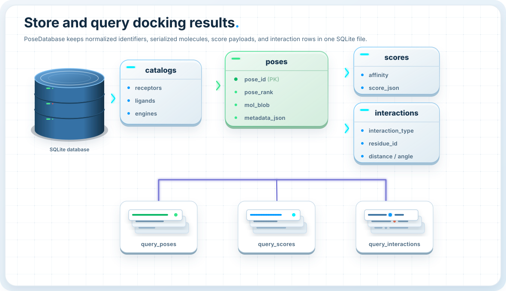
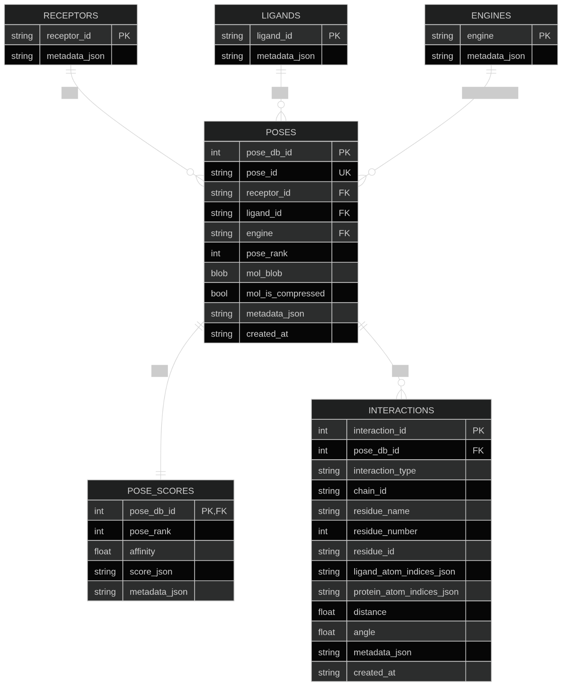

Database
========

ProDock stores docking campaigns in a normalized SQLite database so that poses,
scores, and interactions remain reusable after docking has finished. Instead of
keeping analysis locked inside engine-specific output folders, the database layer
turns results into structured, queryable records that can be filtered,
reconstructed, and compared across receptors, ligands, and docking engines.

Why use the database layer?
---------------------------

Docking campaigns often start as scattered files: ``.pdbqt`` poses, score logs,
interaction tables, and engine-specific naming conventions. That is manageable
for a small test case, but it quickly becomes fragile when a campaign contains
multiple receptors, many ligands, several docking engines, and repeated
postprocessing steps.

The ProDock database solves this by separating **storage** from **analysis**:

- :class:`prodock.database.PoseDatabase` handles schema creation, insertion,
  updating, and persistence.
- :class:`prodock.database.PoseQuery` provides a standalone read/query API for
  filtering, summarizing, and rebuilding analysis-ready views from an existing
  database.

This design gives several practical advantages:

- avoid repeated pose conversion and repeated parsing of engine output
- keep molecules, score payloads, and interaction rows in one consistent schema
- query campaigns later by receptor, ligand, engine, rank, affinity, or residue
- build interaction summaries and fingerprints directly from stored results
- decouple heavy workflow generation from lightweight downstream analysis

What is stored?
---------------

The database uses a compact normalized schema with three main levels of
information:

- **dimension tables** for receptors, ligands, and engines
- **pose records** for identity, molecule storage, and pose metadata
- **analysis tables** for score payloads and residue-level interactions

In practice, this means a pose can be addressed in two ways:

- ``pose_db_id``: internal SQLite primary key
- ``pose_id``: optional stable external identifier such as
  ``"1M17__erlotinib__qvina__pose1"``

If no external ``pose_id`` is stored, the logical identity of a pose is still
well defined by:

.. code-block:: text

   (receptor_id, ligand_id, engine, pose_rank)

This makes the database robust both for automated internal workflows and for
human-readable campaign exports.

Write once, query many times
----------------------------

A useful way to think about the API is:

- :class:`PoseDatabase` is the **writer**
- :class:`PoseQuery` is the **reader**

Typical workflow:

1. collect or generate a pose table from docking/postprocessing
2. insert it once into SQLite with :class:`PoseDatabase`
3. reopen the database later with :class:`PoseQuery`
4. run filtering, interaction analysis, and summary queries without rebuilding
   the dataset

Minimal write example
---------------------

.. code-block:: python

   from prodock.database import PoseDatabase

   db = PoseDatabase("poses.sqlite")
   db.insert_dataframe(pose_dataframe)

This is the simplest entry point when you already have a pandas DataFrame with
the required pose columns:

- ``receptor_id``
- ``ligand_id``
- ``engine``
- ``pose_rank``
- ``affinity``
- ``mol``

Insert poses and interactions together
--------------------------------------

If your workflow already produced interaction payloads, they can be stored at
the same time as the poses. This is especially useful after automated
postprocessing.

.. code-block:: python

   from prodock.database import PoseDatabase

   db = PoseDatabase("poses.sqlite")

   db.insert_dataframe(
       pose_dataframe,
       interactions_by_pose=interactions_by_pose,
       replace=True,
       replace_interactions=True,
   )

Here, ``interactions_by_pose`` is keyed by stored ``pose_id`` values and can use
either a compact summary format or a detailed nested event format.

Example summary payload:

.. code-block:: python

   {
       "1M17__erlotinib__qvina__pose1": {
           "Hydrophobic": ["LEU23.A", "VAL31.A"],
           "HBDonor": ["ASP45.A"],
       }
   }

Example detailed payload:

.. code-block:: python

   {
       "1M17__erlotinib__qvina__pose1": {
           "Hydrophobic": {
               "LEU23.A": [
                   {
                       "distance": 3.8,
                       "indices": {"ligand": [4], "protein": [102]},
                       "metadata": {"source": "prolif"},
                   }
               ]
           }
       }
   }

Build a database directly from a DataFrame
------------------------------------------

For one-step creation, :class:`PoseDatabase` can also construct the full SQLite
file directly from a DataFrame.

.. code-block:: python

   from prodock.database import PoseDatabase

   db = PoseDatabase.from_dataframe(
       "poses.sqlite",
       pose_dataframe,
       interactions_by_pose=interactions_by_pose,
   )

This pattern is convenient for scripted workflows and tutorial notebooks because
it combines initialization and import in one step.

Read-only querying with PoseQuery
---------------------------------

Once a campaign has been stored, downstream analysis should usually be done
through :class:`PoseQuery`. By default, it opens the database in SQLite
read-only mode.

.. code-block:: python

   from prodock.database import PoseQuery

   q = PoseQuery("poses.sqlite")

   poses = q.poses(
       receptor_id="1M17",
       engine="qvina",
       as_dataframe=True,
   )
   print(poses[["pose_id", "pose_rank", "affinity"]].head())

This separation is useful because it makes analysis code cleaner and reduces the
risk of accidentally modifying stored campaign results.

Query one exact pose
--------------------

A single pose can be retrieved by internal id, external ``pose_id``, or the
logical key.

.. code-block:: python

   pose = q.pose(
       receptor_id="1M17",
       ligand_id="erlotinib",
       engine="qvina",
       pose_rank=1,
       include_interactions=True,
       interaction_mode="summary",
   )
   print(pose)

This is helpful when inspecting the best-ranked pose of one
receptor-ligand-engine combination.

Query score tables
------------------

Score records can be queried independently from pose records. This is useful
when the molecule object is not needed and only ranking or score payloads are of
interest.

.. code-block:: python

   scores = q.scores(
       receptor_id="1M17",
       top_rank=3,
       as_dataframe=True,
   )
   print(scores[["pose_id", "affinity"]])

Interaction-aware pose queries
------------------------------

One of the main advantages of storing interactions in the same database is that
pose queries can be filtered by interaction content.

.. code-block:: python

   selected = q.poses(
       receptor_id="1M17",
       interaction_type="Hydrophobic",
       residue_id="LEU23.A",
       as_dataframe=True,
   )
   print(selected[["pose_id", "affinity"]])

This allows you to search for poses that satisfy both scoring constraints and
interaction constraints in one query layer.

Compact interaction summaries
-----------------------------

For many downstream tasks, a compact summary is easier to work with than raw
interaction rows. ProDock can rebuild summary payloads directly from the stored
interaction table.

.. code-block:: python

   summary = q.interaction_summary(
       receptor_id="1M17",
       return_by="pose_id",
   )
   print(summary)

The returned format is:

.. code-block:: python

   {
       "pose_id": {
           "Hydrophobic": ["LEU23.A", "VAL31.A"],
           "HBDonor": ["ASP45.A"],
       }
   }

Detailed interaction payloads
-----------------------------

When per-event atom indices, distances, angles, or richer metadata are needed,
the detailed interaction format can be reconstructed as well.

.. code-block:: python

   details = q.interaction_details(
       receptor_id="1M17",
       return_by="pose_key",
   )
   print(details)

This is especially useful when interaction analysis must be exported to other
tools or when notebook workflows need event-level inspection.

Interaction fingerprint matrices
--------------------------------

The stored interaction table can also be converted directly into a
pose-by-feature interaction matrix. Features are defined as
``interaction_type::residue_id``.

.. code-block:: python

   fp = q.fingerprint(
       receptor_id="1M17",
       mode="binary",
       index_by="pose_key",
   )
   print(fp.head())

This representation is useful for:

- pose clustering
- similarity analysis
- interaction pattern comparison
- machine-learning style downstream workflows

Campaign-level summary
----------------------

For a fast overview of the database contents, ProDock provides a campaign-level
summary grouped by receptor, ligand, and engine.

.. code-block:: python

   print(q.summary())

The summary includes:

- number of stored poses
- best affinity value
- maximum stored pose rank
- number of linked interaction rows

This is often the most convenient first check after importing a new campaign.

Reusing an existing database connection
---------------------------------------

Advanced workflows may already have an open :class:`PoseDatabase` object. In
that case, :class:`PoseQuery` can reuse the active SQLite connection instead of
opening the file again.

.. code-block:: python

   from prodock.database import PoseDatabase, PoseQuery

   db = PoseDatabase("poses.sqlite", create=False)
   q = PoseQuery(connection=db.connection)

   print(q.receptors())
   print(q.ligands())
   print(q.engines())

This pattern is convenient inside larger scripted pipelines.

Visual schema
-------------

.. image:: ../_static/db-architecture.svg
   :alt: ProDock database architecture
   :class: pd-visual

The schema is organized so that receptor, ligand, and engine identifiers are
stored once, while pose-specific and interaction-specific records remain linked
through stable keys. This keeps the database compact while still supporting
many-to-many campaign queries across receptors, ligands, engines, and pose
ranks.

Original detailed schema
------------------------

Recommended usage pattern
-------------------------

For most projects, the recommended pattern is:

.. code-block:: python

   from prodock.database import PoseDatabase, PoseQuery

   # Step 1: write results once
   db = PoseDatabase("poses.sqlite")
   db.insert_dataframe(pose_dataframe, interactions_by_pose=interactions_by_pose)

   # Step 2: analyze later through the read-only query API
   q = PoseQuery("poses.sqlite")

   best = q.poses(
       receptor_id="1M17",
       top_rank=1,
       include_interactions=True,
       interaction_mode="summary",
       as_dataframe=True,
   )

   fp = q.fingerprint(receptor_id="1M17", mode="binary")
   summary = q.summary()

This write-once, query-many design is the main reason the database layer scales
well from a small tutorial example to larger multi-receptor, multi-ligand,
multi-engine docking campaigns.