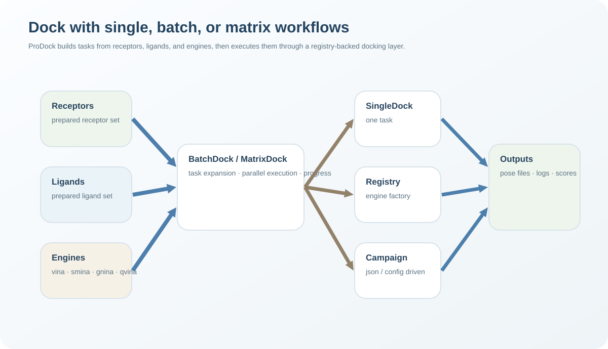

Dock
====

.. raw:: html

   

     

       

         <svg viewBox="0 0 24 24" fill="none" stroke="currentColor" stroke-width="1.9" stroke-linecap="round" stroke-linejoin="round">
           <path d="M7 12h10"/>
           <path d="M12 7v10"/>
           <circle cx="12" cy="12" r="7"/>
         </svg>
       

       <h3>Single docking runs</h3>
       

         Run one receptor–ligand docking job with a registered engine through a
         compact fluent interface.
       

     

     

       

         <svg viewBox="0 0 24 24" fill="none" stroke="currentColor" stroke-width="1.9" stroke-linecap="round" stroke-linejoin="round">
           <rect x="4" y="5" width="6" height="6" rx="1.5"/>
           <rect x="14" y="5" width="6" height="6" rx="1.5"/>
           <rect x="4" y="13" width="6" height="6" rx="1.5"/>
           <rect x="14" y="13" width="6" height="6" rx="1.5"/>
         </svg>
       

       <h3>Batch orchestration</h3>
       

         Normalize many docking jobs into tasks and execute them serially or in
         parallel across flat or receptor-centric layouts.
       

     

     

       

         <svg viewBox="0 0 24 24" fill="none" stroke="currentColor" stroke-width="1.9" stroke-linecap="round" stroke-linejoin="round">
           <path d="M6 6h12v12H6z"/>
           <path d="M9 9h6M9 12h6M9 15h4"/>
         </svg>
       

       <h3>Configuration-driven campaigns</h3>
       

         Describe docking jobs as reusable config objects or JSON/YAML files and
         run them through the same engine-agnostic workflow.
       

     

     

       

         <svg viewBox="0 0 24 24" fill="none" stroke="currentColor" stroke-width="1.9" stroke-linecap="round" stroke-linejoin="round">
           <path d="M5 8h14"/>
           <path d="M5 12h14"/>
           <path d="M5 16h14"/>
           <circle cx="8" cy="8" r="1"/>
           <circle cx="8" cy="12" r="1"/>
           <circle cx="8" cy="16" r="1"/>
         </svg>
       

       <h3>Engine registry</h3>
       

         Resolve engines by name and switch between Vina-family backends without
         changing the surrounding workflow code.
       

     

   

Docking architecture
--------------------

The docking layer is built around one simple split:

- :class:`SingleDock` for one run,
- :class:`BatchDock` for many runs,
- config objects for reproducible campaign definitions,
- a backend registry that maps engine names to implementations.

By default, the registry exposes these engines:

- ``vina``
- ``smina``
- ``gnina``
- ``qvina``
- ``qvina-w``

This design keeps the public workflow stable even when the backend executable
changes.

Single docking
--------------

.. raw:: html

   

     

       

         <svg viewBox="0 0 24 24" fill="none" stroke="currentColor" stroke-width="1.85" stroke-linecap="round" stroke-linejoin="round">
           <path d="M7 12h10"/>
           <path d="M12 7v10"/>
           <circle cx="12" cy="12" r="7"/>
         </svg>
       

       

         <h2>SingleDock</h2>
         
Run one receptor–ligand docking job through a fluent engine-agnostic interface.

       

     

   

Use :class:`SingleDock` when you want to launch a single docking run directly
from Python.

Typical use cases include:

- testing one ligand quickly,
- comparing engines on one receptor–ligand pair,
- prototyping box settings before launching a batch,
- driving one run from a :class:`SingleConfig`.

.. code-block:: python

   from prodock.dock import SingleDock

   result = (
       SingleDock("qvina")
       .set_receptor("protein.pdbqt", validate=True)
       .set_ligand("ligand.pdbqt")
       .set_box(
           center=(12.0, 5.5, -1.2),
           size=(18.0, 20.0, 16.0),
       )
       .set_out("dock_out.pdbqt")
       .set_log("dock.log")
       .run()
   )

   print(result.artifacts.out_path)
   print(result.artifacts.log_path)

Autoboxing is also supported:

.. code-block:: python

   result = (
       SingleDock("vina")
       .set_receptor("protein.pdbqt")
       .set_ligand("ligand.pdbqt")
       .enable_autobox("ref_ligand.pdbqt", padding=4.0)
       .set_out("dock_out.pdbqt")
       .set_log("dock.log")
       .run()
   )

Configuration-driven single runs are also available:

.. code-block:: python

   from prodock.dock import SingleDock, SingleConfig, Box

   cfg = SingleConfig(
       engine="vina",
       receptor="protein.pdbqt",
       ligand="ligand.pdbqt",
       box=Box(
           center=(12.0, 5.5, -1.2),
           size=(18.0, 20.0, 16.0),
       ),
       out="dock_out.pdbqt",
       log="dock.log",
   )

   result = SingleDock.run_from_config(cfg)
   print(result.artifacts.out_path)

.. raw:: html

   

     <strong>See API:</strong>
     <a href="../api/dock.html">Dock API reference</a>
   

Batch docking
-------------

.. raw:: html

   

     

       

         <svg viewBox="0 0 24 24" fill="none" stroke="currentColor" stroke-width="1.85" stroke-linecap="round" stroke-linejoin="round">
           <rect x="4" y="5" width="6" height="6" rx="1.5"/>
           <rect x="14" y="5" width="6" height="6" rx="1.5"/>
           <rect x="4" y="13" width="6" height="6" rx="1.5"/>
           <rect x="14" y="13" width="6" height="6" rx="1.5"/>
         </svg>
       

       

         <h2>BatchDock</h2>
         
Normalize many docking jobs into tasks and execute them serially or in parallel.

       

     

   

:class:`BatchDock` supports two input styles:

- **flat row-based batches** with :class:`DockRow`
- **receptor-centric batches** with :class:`ReceptorSpec`

This makes it suitable both for simple ligand lists and for larger multi-engine
campaigns.

Flat row workflow:

.. code-block:: python

   from prodock.dock import BatchDock

   rows = [
       {
           "id": "erlotinib",
           "receptor": "4WKQ.pdbqt",
           "ligand": "erlotinib.pdbqt",
           "center": [2.865, 193.257, 21.367],
           "size": [27.091, 27.091, 27.091],
       }
   ]

   batch = BatchDock(engine="qvina", n_jobs=4)
   results = batch.run(
       rows,
       out_dir="docked",
       log_dir="logs",
       exhaustiveness=8,
       n_poses=10,
   )

   print(results[0].success)
   print(results[0].out_path)

Receptor-centric workflow:

.. code-block:: python

   from prodock.dock import BatchDock, ReceptorSpec, SoftwareSpec, LigandSpec, Box

   receptors = [
       ReceptorSpec(
           id="4WKQ",
           receptor="4WKQ.pdbqt",
           box=Box(
               center=(2.865, 193.257, 21.367),
               size=(27.091, 27.091, 27.091),
           ),
           softwares=[
               SoftwareSpec(
                   name="qvina",
                   ligands=[
                       LigandSpec(id="erlotinib", ligand="erlotinib.pdbqt"),
                       LigandSpec(id="gefitinib", ligand="gefitinib.pdbqt"),
                   ],
               )
           ],
       )
   ]

   batch = BatchDock(n_jobs=4)
   results = batch.run_receptors(
       receptors,
       out_dir="results/docked",
       log_dir="results/logs",
   )

   print(len(results))

Internally, batch execution works in two steps:

1. create normalized :class:`DockTask` objects,
2. execute them with :meth:`run_tasks`.

Each completed task returns a :class:`DockResult`.

.. raw:: html

   

     <strong>See API:</strong>
     <a href="../api/dock.html">Dock API reference</a>
   

Configuration objects
---------------------

.. raw:: html

   

     

       

         <svg viewBox="0 0 24 24" fill="none" stroke="currentColor" stroke-width="1.85" stroke-linecap="round" stroke-linejoin="round">
           <path d="M6 6h12v12H6z"/>
           <path d="M9 9h6M9 12h6M9 15h4"/>
         </svg>
       

       

         <h2>SingleConfig, BatchConfig, and campaign specs</h2>
         
Describe docking jobs as reusable config objects or JSON/YAML files.

       

     

   

The docking layer provides a small configuration model:

- :class:`Box` for center and size
- :class:`SingleConfig` for one run
- :class:`DockRow` for flat batch rows
- :class:`LigandSpec`, :class:`SoftwareSpec`, and :class:`ReceptorSpec` for receptor-centric layouts
- :class:`BatchConfig` for full batch configuration

A batch can be created directly from configuration:

.. code-block:: python

   from prodock.dock import BatchDock

   batch = BatchDock.from_config("batch.json")
   results = BatchDock.run_from_config("batch.json")

   print(len(results))

The configuration loader accepts dictionaries and JSON or YAML files, which
makes it convenient for CLI-driven or reproducible campaign workflows.

Engine registry
---------------

.. raw:: html

   

     

       

         <svg viewBox="0 0 24 24" fill="none" stroke="currentColor" stroke-width="1.85" stroke-linecap="round" stroke-linejoin="round">
           <path d="M5 8h14"/>
           <path d="M5 12h14"/>
           <path d="M5 16h14"/>
           <circle cx="8" cy="8" r="1"/>
           <circle cx="8" cy="12" r="1"/>
           <circle cx="8" cy="16" r="1"/>
         </svg>
       

       

         <h2>Engine registry</h2>
         
Resolve engines by name and keep the high-level API backend-agnostic.

       

     

   

The registry maps engine names to backend factories. This lets the public API
use stable engine keys such as ``"vina"`` or ``"qvina"`` without exposing
backend construction details.

Available engines can be listed at runtime:

.. code-block:: python

   from prodock.dock import available

   print(available())

Custom backends can also be registered:

.. code-block:: python

   from prodock.dock import register

   class MyBackend:
       ...

   register("myengine", lambda: MyBackend())

This is useful when extending ProDock with new binaries or custom wrappers.

.. raw:: html

   

     <strong>See API:</strong>
     <a href="../api/dock.html">Dock API reference</a>
   

Minimal end-to-end example
--------------------------

.. raw:: html

   

     
Example

     <h2>Dock one receptor against multiple ligands</h2>
   

.. code-block:: python

   from prodock.dock import BatchDock

   rows = [
       {
           "id": "erlotinib",
           "receptor": "4WKQ.pdbqt",
           "ligand": "erlotinib.pdbqt",
           "center": [2.865, 193.257, 21.367],
           "size": [27.091, 27.091, 27.091],
       },
       {
           "id": "gefitinib",
           "receptor": "4WKQ.pdbqt",
           "ligand": "gefitinib.pdbqt",
           "center": [2.865, 193.257, 21.367],
           "size": [27.091, 27.091, 27.091],
       },
   ]

   results = BatchDock(engine="qvina", n_jobs=2).run(
       rows,
       out_dir="results/docked",
       log_dir="results/logs",
       exhaustiveness=8,
       n_poses=10,
   )

   for r in results:
       print(r.job_id, r.success, r.out_path)

See also
--------

- :doc:`../api/dock` — full reference for ``SingleDock``, ``BatchDock``, configs, and engine registry
- :doc:`../tutorial/preprocess` — prepare ligands, receptors, and docking boxes before docking
- :doc:`../tutorial/postprocess` — analyze logs, poses, interactions, and metrics after docking