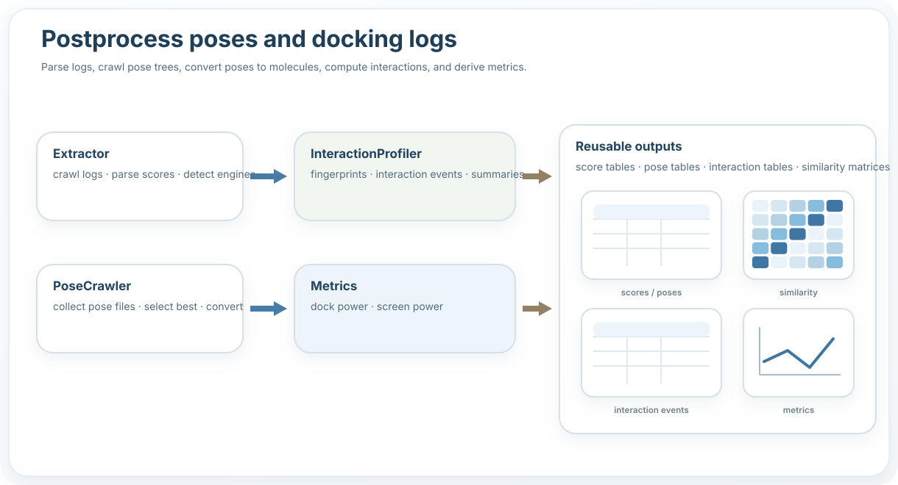

Postprocess
===========

What this stage does
--------------------

- Parse docking logs into score tables.
- Crawl pose trees and convert structures.
- Compute protein-ligand interactions.
- Build metrics and reusable summaries.

Typical example
---------------

.. code-block:: python

   from prodock.postprocess import extract_scores
   from prodock.postprocess.interaction.core import extract_pose_table_interactions

   scores = extract_scores("logs", mode="auto")
   interactions = extract_pose_table_interactions(pose_table, receptor_map)

Main objects
------------

- ``Extractor``
- ``PoseCrawler``
- ``InteractionProfiler``
