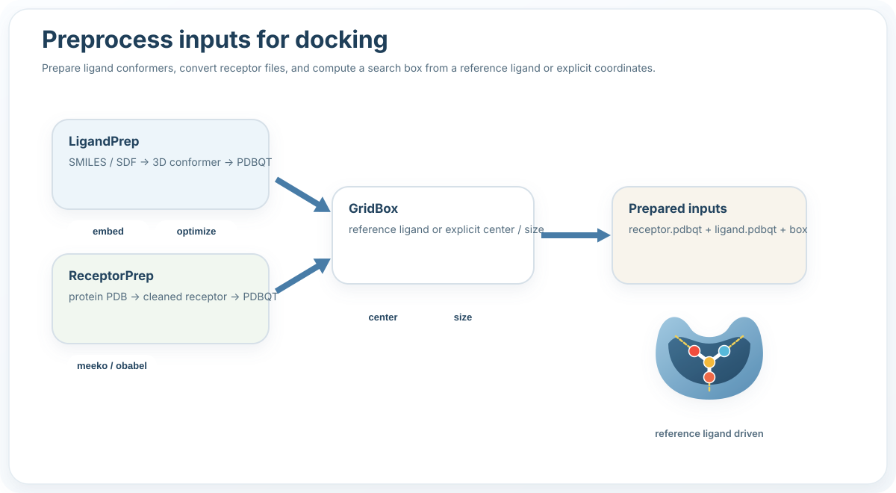

Preprocess
==========

What this stage does
--------------------

- Generate ligand conformers and output files.
- Prepare receptor structures for docking.
- Compute a docking box from a ligand or explicit coordinates.

Typical example
---------------

.. code-block:: python

   from prodock.preprocess import LigandPrep, ReceptorPrep, GridBox

   ligands = LigandPrep(output_dir="ligands").from_smiles_list(LIGANDS).process_all()
   receptor = ReceptorPrep().prep("EGFR_1M17.pdb")
   box = GridBox().load_ligand("AQ4.sdf")

Main objects
------------

- ``LigandPrep``
- ``ReceptorPrep``
- ``GridBox``
