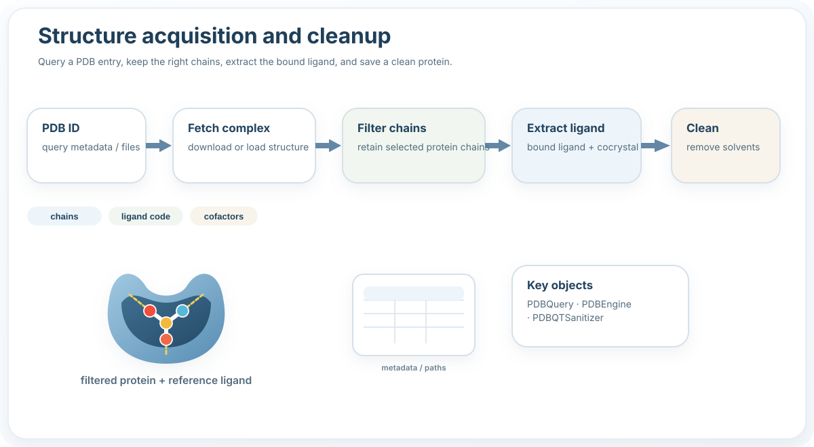

Structure
=========

What this stage does
--------------------

- Query a PDB entry.
- Retain selected chains.
- Extract the bound ligand.
- Save a clean protein for downstream preparation.

Typical example
---------------

.. code-block:: python

   from prodock.structure import PDBEngine

   engine = PDBEngine(
       pdb_id="1M17",
       base_out="EGFR_1M17",
       chains=["A"],
       ligand_code="AQ4",
   ).run_all()

Main objects
------------

- ``PDBQuery``
- ``PDBEngine``
- ``PDBQTSanitizer``
